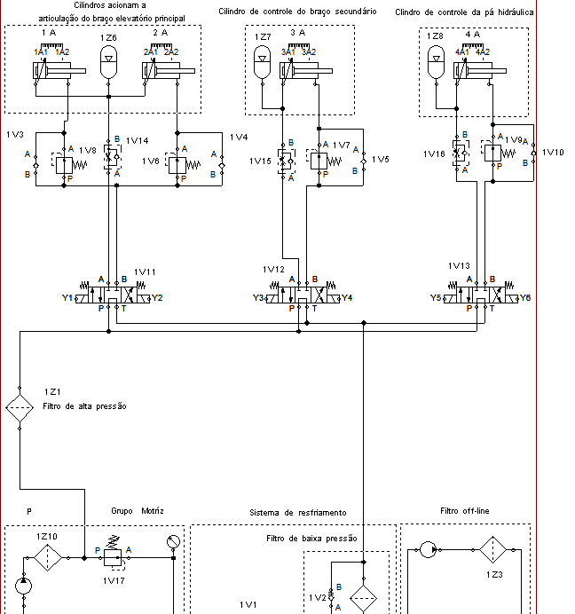
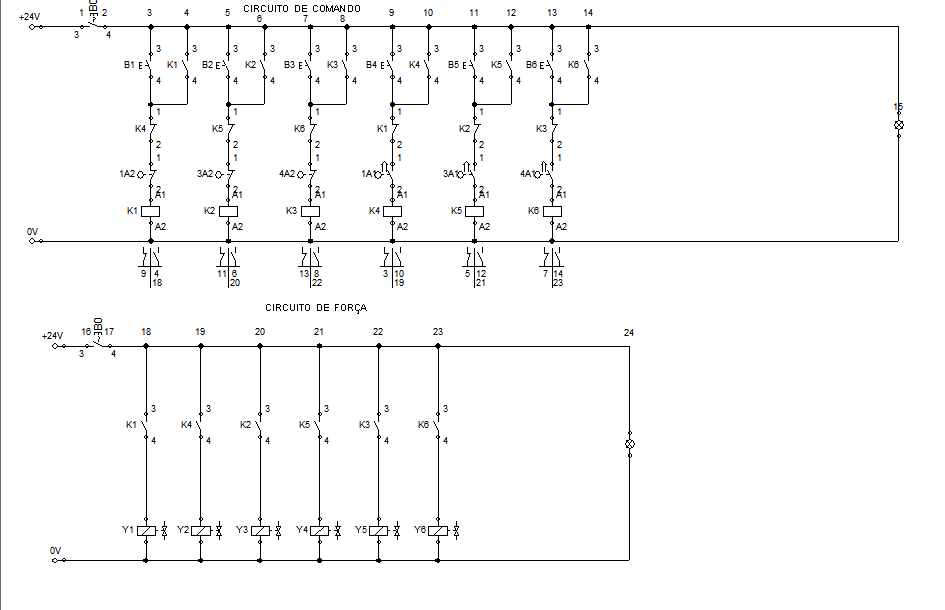

# Avalia-o_3_SHP

Avaliação da terceira unidade de  SISTEMAS HIDRÁULICOS E PNEUMÁTICOS (SHP).

Nessa atividade fiz o sistema hidráulica e os acionamentos elétricos  individuais.

O circuito foi divido em dois:

* Circuito de Comando.

* Circuito de Força.